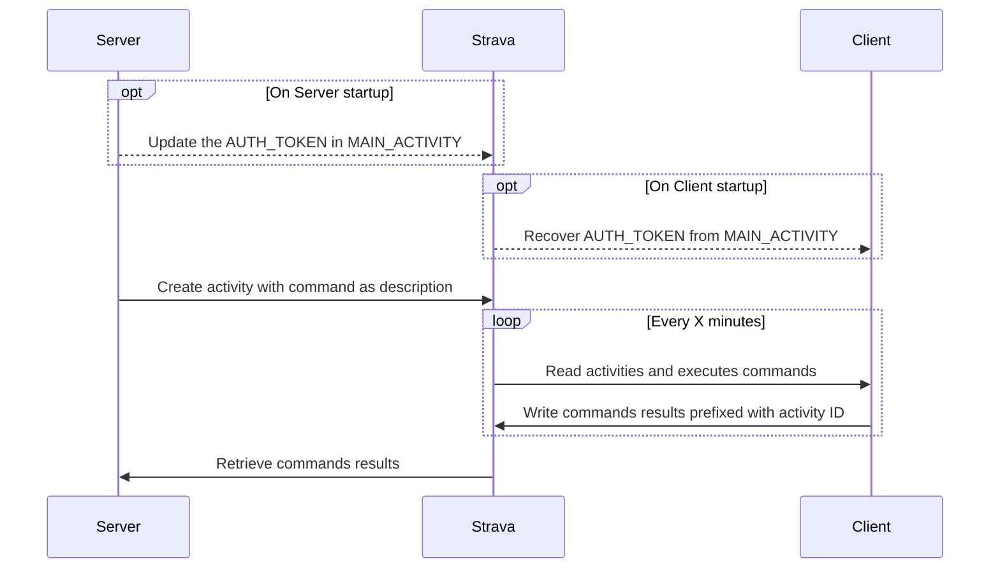

# Strava C2 Proof of Concept

This project is a small proof of concept (PoC) of a command-and-control (C2) agent/server that uses the Strava API to facilitate covert communication. The name "Concept C2" is a wordplay on the famous rowing machine, the Concept2, and a C2 server.



## Features

The following functionalities are currently implemented:

- **Bi-directional communication** using Strava activity descriptions to exchange data between client and server.
- **Multi-client support**: Multiple clients can connect to the same Strava account, simplifying follow-on operations.
- **Encode data in UTF-8**: Use UTF-8 data smuggling to hide query and response data to the human eye! (cf. this [article](https://paulbutler.org/2025/smuggling-arbitrary-data-through-an-emoji/))
- **Automatic API token renewal**: The client can reconnect to the C2 server even after long downtimes (e.g., via a scheduled task on reboot).
- **Interactive server interface**: A minimal TUI (Textual User Interface) using the [Textual](https://github.com/Textualize/textual) library, enabling command execution on a specific client.


## Usage

Both the client and server are written in Python and are straightforward to execute.

### Prerequisites

Ensure you have the following dependencies installed:

- Python 3.x
- `requests` (for API communication)
- `textual` (for the TUI server interface)

It is advised to use uv to run client and server scripts.

### Configuration

Several variables must be configured before running the project:

- `MAIN_ACTIVITY`: A public Strava activity used to share new API tokens between the server and clients.
- `CLIENT_ID` and `CLIENT_SECRET`: Credentials provided by Strava to generate and refresh API tokens.

### Client/Agent build

While for testing purpose these variables could be provided in a `.env` file, if you are willing to install the client elsewhere YOU should hardcode the `MAIN_ACTIVITY`.

```bash
>>> uv run python -m nuitka --standalone --onefile client.py
Nuitka: Successfully created 'client.bin'.
```

### Running the Client

```
python client.py
```

### Running the Server

```
python server.py
```

## Potential Improvements and Future Work

Several enhancements and tests could be implemented to extend the functionality and robustness of the project:

- **Persistent Command History**: Store commands and responses in a SQLite database on the server side.
- **Client Initialization**: Implement a client initialization routine that creates an initial activity to signal a successful connection.
- **Improved Server Interface**: Enhance the TUI for better usability and performance.
- **Activity Cleanup**: Automatically delete activities once they are processed to reduce exposure.
- **Client Compilation**: Package the client as a standalone executable using tools like `pyinstaller`.
- **Enhanced Data Exfiltration**: Explore using GPX files for data exfiltration, although they are extensively sanitized by Strava.

---

Contributions and feedback are welcome!
